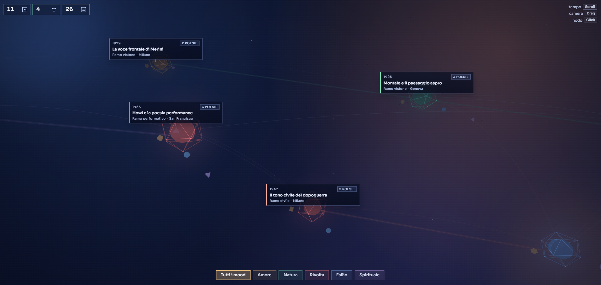
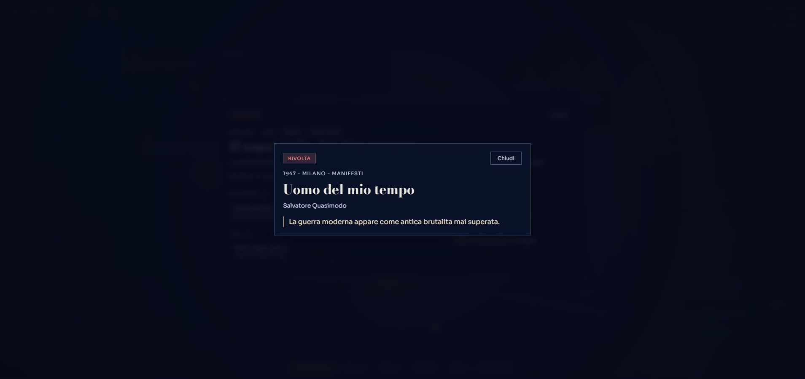
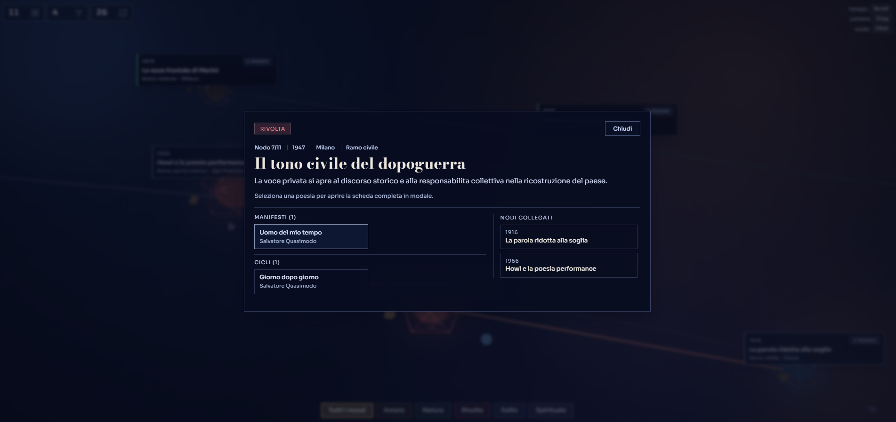
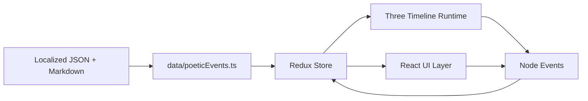

# 🌌 poc-fe-react-poetry-viewer

<p align="center">
  <strong>A cinematic 3D poetry archive built with React, Three.js, and a JSON + Markdown content engine.</strong>
</p>

<p align="center">
  
  
  
  
  
  
</p>

<p align="center">
  
</p>

<p align="center">
  Explore poetic history as an abstract memory flow: navigate nodes, filter moods, open event modals, then dive into poem details.
</p>

---

## ✨ Highlights

- 🎯 **Fullscreen 3D timeline** with abstract nodes, branches, and connection trails.
- 🧭 **Interaction-first navigation**: `Scroll` timeline, `Drag` camera, `Click` node.
- 🧠 **Content-driven architecture** with localized JSON events + Markdown poem files.
- 🧩 **Redux Toolkit state model** for filters, selection, modals, and locale state.
- 🌍 **Bilingual runtime**: Italian (`it`) and English (`en`).
- 🎨 **Tokenized Sass system** with global design primitives + component styles.

---

## 🖼️ UI Gallery

| Timeline Experience | Event Modal |
| --- | --- |
|  |  |

| Poem Modal |
| --- |
|  |

---

## 🧱 Stack

| Layer | Tools |
| --- | --- |
| Frontend | React 19, TypeScript 5 |
| 3D Rendering | Three.js |
| State | Redux Toolkit, React Redux |
| Styling | Sass (`.scss`) + global design tokens |
| Build | Vite 7 |
| Quality | ESLint + Prettier + TypeScript checks |

---

## 🚀 Quick Start

### 1. Requirements

- Node.js `20+`
- npm `10+`

### 2. Install

```bash
npm install
```

### 3. Run dev server

```bash
npm run dev
```

### 4. Build and preview

```bash
npm run build
npm run preview
```

---

## 🛠️ Available Scripts

| Script | Purpose |
| --- | --- |
| `npm run dev` | Start local development |
| `npm run build` | Typecheck + production build |
| `npm run preview` | Preview built app |
| `npm run lint` | Run ESLint checks |
| `npm run lint:fix` | Auto-fix lint issues |
| `npm run format` | Apply Prettier formatting |
| `npm run typecheck` | Run TypeScript checks only |

---

## 🗂️ Content Configuration

This project is fully content-configurable:

- **Events JSON**: `src/content/locales/<locale>/poetic-events.json`
- **Poem Markdown**: `src/content/locales/<locale>/poems/**/*.md`
- **UI runtime config**: `src/content/ui-config.json` (for example startup loader options)

### Event schema concept

- Event identity: `id`, `year`, `title`, `location`
- Semantics: `mood`, `branch`, optional `branchFrom`
- Topology: `connections[]`
- Poetry payload: `poems[]` with markdown references

---

## 🌍 Localization

Supported locales:

- 🇮🇹 `it`
- 🇬🇧 `en`

Localization layers:

- UI dictionaries: `src/i18n/locales/*.json`
- i18n helpers: `src/i18n/index.ts`, `src/i18n/useI18n.ts`
- Redux locale slice: `src/features/locale/localeSlice.ts`

---

## 🏗️ Architecture



### Runtime modules

- `src/components/three-timeline/` -> scene, runtime, projection, label behavior
- `src/components/node-modal/` -> modal sections and layout styles
- `src/data/` -> content loaders and UI config adapters
- `src/features/` -> state slices/selectors
- `src/styles/` -> global tokens and shared foundation styles

---

## 🎨 Design System Notes

The visual language is intentionally minimal and atmospheric:

- deep-space gradient canvas
- sharp rectangular UI surfaces
- accent-coded mood chips and labels
- low-noise, high-contrast typography for readability over 3D scenes

Global tokens are centralized in:

- `src/styles/global.scss`

---

## ✅ Quality Gate

Recommended pre-commit sequence:

```bash
npm run format
npm run lint
npm run typecheck
npm run build
```

---

## ⚡ Performance

- Three.js is the largest bundle contributor.
- Chunk-size warnings can occur in production builds for 3D-heavy apps.
- Typical optimizations:
  1. lazy load non-critical UI sections
  2. split heavy runtime chunks
  3. simplify materials/geometry when needed

---

## 📁 Project Structure

```text
src/
  app/                         # Redux store + typed hooks
  components/                  # UI components and modal layers
  components/three-timeline/   # 3D timeline runtime modules
  content/                     # Localized JSON and Markdown content
  data/                        # Data loaders and UI configuration
  features/                    # Redux slices/selectors
  i18n/                        # Translation runtime and dictionaries
  styles/                      # Global tokens and shared style foundation
```

## 📄 License

Released under the **MIT License**. See `LICENSE`.
